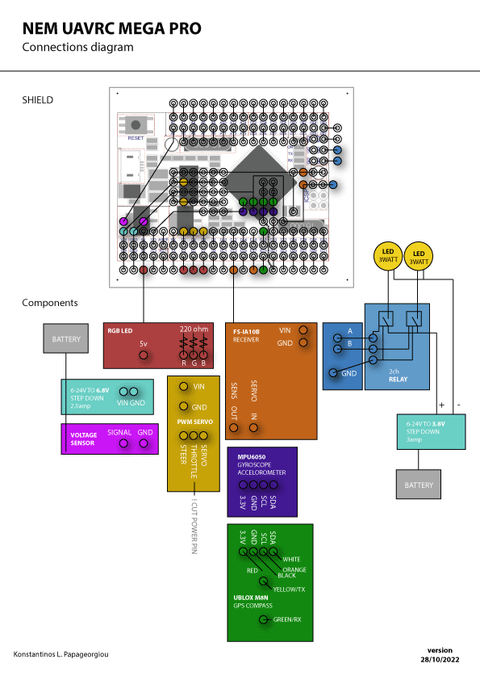

# NEM UAVRC MEGA

NEM Unmanned Vehicle Remote Controlled software on Arduino Mega 2550 pro

## Software Features :

- Software utilises an MPU6050, GPS, Servo, ESC, magnetometer and an amphidromous remote control, powered by an Arduino mega pro.
- Sensors and actuators are all in classes
- Implement seven tasks execution frequencies
- Adaptive steering based on target degrees
- Boots ESC motor and applies a non liner transfer function to the speed remote input
- Computes degrees heading at boot time, used as an offset for the MPU degree heading
- Derives distance and degrees from a target GPS LAT LOT
- Return to target GPS / home on signal loss or switch D
- Adaptive speed while approaching target
- Detection of low battery and return to home
- Transmits distance of vehicle from target GPS
- Lowers throttle while turning
- RGB Led indicator - no GPS red, GPS lock - green, return to home blue
- Variable led blinking indicator
- Target GPS restoration, after power loss

## Hardware

Sensors :

- GPS : [Ublox M8N with compass](https://www.aliexpress.com/item/4001267138914.html)
- Magmetometer : M8n's HMC5883
- MPU : [MPU6050](https://www.aliexpress.com/item/32340949017.html)
- Receiver  [flysky F9-ia10b](https://www.aliexpress.com/item/1005002151189775.html)
- Voltage sensor 0-25v [MH-electronic](https://www.hellasdigital.gr/electronics/sensors/current-sensors/voltage-sensor-module-for-robot-arduino-dc-0-25-v/)

Components : 

- [Arduino mega pro 2560](https://www.aliexpress.com/item/1005002828018807.html)
- Transmitter [flysky FS-I6X](https://www.aliexpress.com/item/1005002086903692.html)
- DC to DC Step down [3 amp](https://grobotronics.com/dc-dc-step-down-1.3-35v-3a.html)
- DC to DC Step down ultra small [2.5 amp](https://www.aliexpress.com/item/32880983608.html)
- Solid state 2 channel relay [SSR 5V 2A - 2 Channel](https://grobotronics.com/relay-module-ssr-5v-2a-2-channel.html)
- High Power Led 3W - [Cold White](https://grobotronics.com/high-power-led-3w-cold-white-emitter-2.html)
- High Power Led 3W - [Green](https://grobotronics.com/high-power-led-3w-green-emitter-2.html)
- RGB LED [anode](https://grobotronics.com/led-clear-5mm-rgb-common-anode.html)
- 3X 220Ohm [resistance](https://grobotronics.com/resistor-1-4w-metal-1-220ohm.html)
- Battery 7.4V-24V
- [Male Pin headers](https://grobotronics.com/pin-header-1x40-male-2.54mm-black-long-centered.html)
- [Female Pin headers](https://grobotronics.com/pin-header-1x10-female-2.54mm.html)
- [Cable with compatible JST BEC](http://www.nemhobby.com/plug-extension-silicone-wire-10cm-with-jst-gold-connectors-male-p34787.html)
- [XT60 Gold Connectors - Set](http://www.nemhobby.com/xt60-gold-connectors-set-p32855.html)
- [T-Plug Gold Connector - Male](http://www.nemhobby.com/t-plug-gold-connector-male-p34785.html)
- [Ribbon cable](https://grobotronics.com/ribbon-cable-28awg-0.081mm2-14-wire.html)
- Red, black wire
- PCB Etching agent
- [1mm drills](https://www.ergaleiogatos.gr/shop/trypania-sidirou-hss-bluespot-set-10-temachion/)
- NEM PCB Shield

